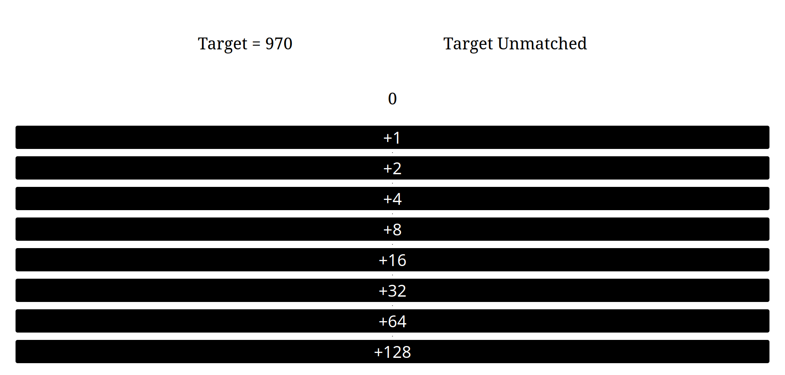
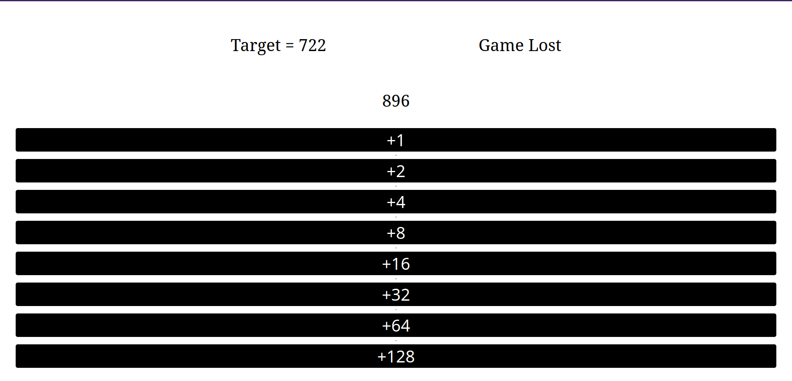

# CountGame
Very simple math game implemented in [Yew](https://yew.rs/) framework

___
# Building
1. [Intsall rust](https://www.rust-lang.org/tools/install) 
2. Install wasm-bindgen <br> ```rustup target add wasm32-unknown-unknown``` 
3. Install trunk <br> ```cargo install trunk```
4. Start server <br> ```trunk serve```

# Screens 




